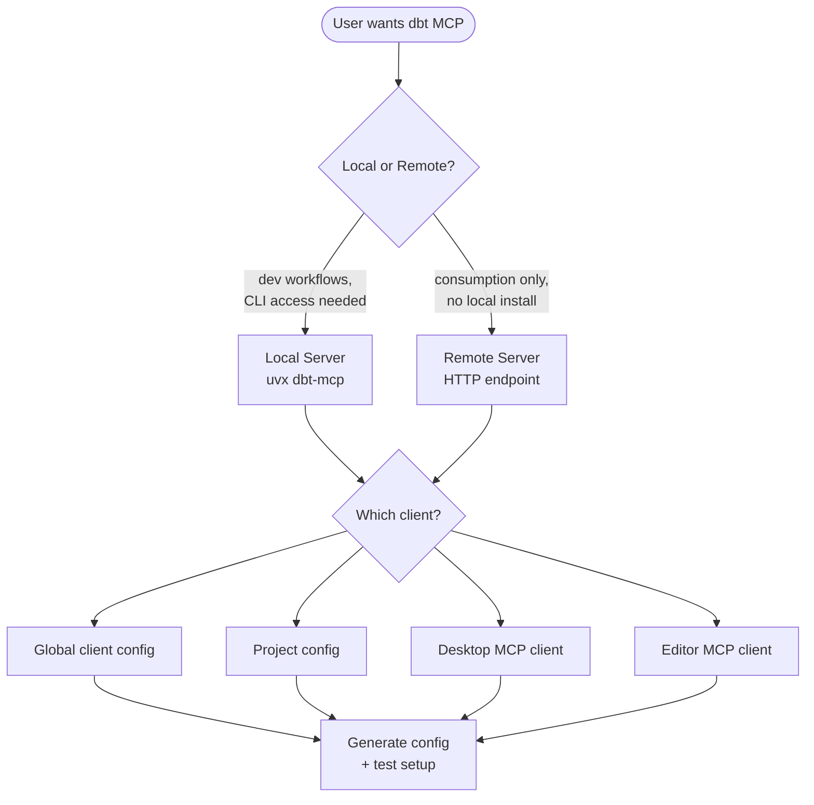

# Configure dbt MCP Server

## Overview

The dbt MCP server links AI tools to dbt's CLI, Semantic Layer, Discovery API, and Admin API. This skill walks users through setup with the appropriate configuration for their situation.

## Decision Flow



## Questions to Ask

### 1. Server Type
**Ask:** "Would you like to use the **local** or **remote** dbt MCP server?"

| Local Server                                                                                                                                             | Remote Server                                               |
| -------------------------------------------------------------------------------------------------------------------------------------------------------- | ----------------------------------------------------------- |
| Runs on your machine via `uvx`                                                                                                                           | Connects via HTTP to dbt platform                           |
| Required for development (authoring models, tests, docs) but can also connect to the dbt platform for consumption (querying metrics, exploring metadata) | Best for consumption (querying metrics, exploring metadata) |
| Supports dbt CLI commands (run, build, test, show)                                                                                                       | No CLI commands (run, build, test)                          |
| Works without a dbt platform account but can also connect to the dbt platform for development (authoring models, tests, docs)                            | Requires dbt platform account                               |
| No credit consumption                                                                                                                                    | Consumes dbt Copilot credits                                |

### 2. MCP Client
**Ask:** "Which MCP client are you working with?"
- Global client config
- Project config
- Desktop MCP client
- Editor MCP client

### 3. Use Case (Local Server Only)
**Ask:** "What is your intended use case?"

| CLI Only | Platform Only | Platform + CLI |
|----------|---------------|----------------|
| dbt Core/Fusion users | dbt Cloud without local project | Full access to both |
| No platform account needed | OAuth or token auth | Requires paths + credentials |

### 4. Tools to Enable
**Ask:** "Which tools should be enabled?" (show defaults)

| Tool Category | Default | Environment Variable |
|---------------|---------|---------------------|
| dbt CLI (run, build, test, compile) | Enabled | `DISABLE_DBT_CLI=true` to disable |
| Semantic Layer (metrics, dimensions) | Enabled | `DISABLE_SEMANTIC_LAYER=true` to disable |
| Discovery API (models, lineage) | Enabled | `DISABLE_DISCOVERY=true` to disable |
| Admin API (jobs, runs) | Enabled | `DISABLE_ADMIN_API=true` to disable |
| SQL (text_to_sql, execute_sql) | **Disabled** | `DISABLE_SQL=false` to enable |
| Codegen (generate models/sources) | **Disabled** | `DISABLE_DBT_CODEGEN=false` to enable |

## Prerequisites

### Local Server
1. **Install `uv`**: https://docs.astral.sh/uv/getting-started/installation/
2. **Have a dbt project** (needed for CLI commands)
3. **Locate paths:**
   - `DBT_PROJECT_DIR`: Directory containing `dbt_project.yml`
     - macOS/Linux: run `pwd` from the project folder
     - Windows: Full path using forward slashes (e.g., `C:/Users/name/project`)
   - `DBT_PATH`: Path to the dbt executable
     - macOS/Linux: `which dbt`
     - Windows: `where dbt`

### Remote Server
1. **dbt Cloud account** with AI features enabled
2. **Production environment ID** (found on the Orchestration page)
3. **Personal access token** or service token

See [How to Find Your Credentials](references/finding-credentials.md) for step-by-step instructions on obtaining tokens and IDs.

## Credential Security

- Always reference tokens via environment variables (e.g., `${DBT_TOKEN}`) rather than embedding literal values in configuration files that may be committed to version control
- Never print, log, or echo token values in terminal output
- Add `.env` files to `.gitignore` to prevent accidental exposure
- Encourage users to rotate tokens on a regular schedule and apply the least-privilege permission set

## Configuration Templates

### Local Server - CLI Only

```json
{
  "mcpServers": {
    "dbt": {
      "command": "uvx",
      "args": ["dbt-mcp"],
      "env": {
        "DBT_PROJECT_DIR": "/path/to/your/dbt/project",
        "DBT_PATH": "/path/to/dbt"
      }
    }
  }
}
```

### Local Server - Platform + CLI (OAuth)

```json
{
  "mcpServers": {
    "dbt": {
      "command": "uvx",
      "args": ["dbt-mcp"],
      "env": {
        "DBT_HOST": "https://your-subdomain.us1.dbt.com",
        "DBT_PROJECT_DIR": "/path/to/project",
        "DBT_PATH": "/path/to/dbt"
      }
    }
  }
}
```

### Local Server - Platform + CLI (Token Auth)

```json
{
  "mcpServers": {
    "dbt": {
      "command": "uvx",
      "args": ["dbt-mcp"],
      "env": {
        "DBT_HOST": "cloud.getdbt.com",
        "DBT_TOKEN": "your-token",
        "DBT_ACCOUNT_ID": "your-account-id",
        "DBT_PROD_ENV_ID": "your-prod-env-id",
        "DBT_PROJECT_DIR": "/path/to/project",
        "DBT_PATH": "/path/to/dbt"
      }
    }
  }
}
```

### Local Server - Using .env File

```json
{
  "mcpServers": {
    "dbt": {
      "command": "uvx",
      "args": ["--env-file", "/path/to/.env", "dbt-mcp"]
    }
  }
}
```

**.env file contents:**
```
DBT_HOST=cloud.getdbt.com
DBT_TOKEN=your-token
DBT_ACCOUNT_ID=your-account-id
DBT_PROD_ENV_ID=your-prod-env-id
DBT_DEV_ENV_ID=your-dev-env-id
DBT_USER_ID=your-user-id
DBT_PROJECT_DIR=/path/to/project
DBT_PATH=/path/to/dbt
```

### Remote Server

```json
{
  "mcpServers": {
    "dbt": {
      "url": "https://cloud.getdbt.com/api/ai/v1/mcp/",
      "headers": {
        "Authorization": "Token your-token",
        "x-dbt-prod-environment-id": "your-prod-env-id"
      }
    }
  }
}
```

**Additional headers for SQL/Fusion tools:**
```json
{
  "headers": {
    "Authorization": "Token your-token",
    "x-dbt-prod-environment-id": "your-prod-env-id",
    "x-dbt-dev-environment-id": "your-dev-env-id",
    "x-dbt-user-id": "your-user-id"
  }
}
```

## Client-Specific Setup

### Generic MCP Client
1. Open the MCP client's server configuration.
2. Paste in the JSON configuration.
3. Save and restart the client.
4. **Verify:** Confirm the dbt MCP server appears in the list and is reachable.

### Sypha

Add the `mcp` block to your `sypha.json` configuration file.

**Configuration file locations:**
- **Global:** `~/.config/sypha/sypha.json`
- **Project:** `./sypha.json` or `./.sypha/sypha.json` in your project root

Project-level configuration overrides global settings. For project-specific dbt setups, use `.sypha/sypha.json` so all team members share the same configuration.

Add the dbt MCP server entry under the `mcp` key:

```json
{
  "mcp": {
    "dbt": {
      "command": "uvx",
      "args": ["dbt-mcp"],
      "env": {
        "DBT_PROJECT_DIR": "/path/to/project",
        "DBT_PATH": "/path/to/dbt"
      }
    }
  }
}
```

**VS Code Extension:** Go to Sypha Settings > Agent Behaviour > MCP Servers, then select "Edit Global MCP" (or "Edit Project MCP" for a project-specific setup) and insert the configuration above.

### Cursor
1. Navigate to **Cursor menu** → **Settings** → **Cursor Settings** → **MCP**
2. Paste in the JSON configuration
3. Update paths and credentials to match your environment
4. Save

### VS Code
1. Open the **Command Palette** (Cmd/Ctrl + Shift + P)
2. Run **"MCP: Open User Configuration"** (or Workspace for a project-scoped setup)
3. Paste in the JSON configuration (note: VS Code uses `servers` instead of `mcpServers`):

```json
{
  "servers": {
    "dbt": {
      "command": "uvx",
      "args": ["dbt-mcp"],
      "env": {
        "DBT_PROJECT_DIR": "/path/to/project",
        "DBT_PATH": "/path/to/dbt"
      }
    }
  }
}
```

4. Open **Settings** → **Features** → **Chat** → turn on **MCP**
5. **Verify:** Run **"MCP: List Servers"** from the Command Palette

**WSL Users:** Configure under Remote settings, not local user settings:
- Run **"Preferences: Open Remote Settings"** from the Command Palette
- Use full Linux paths (e.g., `/home/user/project`), not Windows-style paths

## Verification Steps

### Test Local Server Config

**Recommended: Use a .env file**
1. Create a `.env` file in your project root and set the minimum environment variables needed for CLI tools:
```bash
DBT_PROJECT_DIR=/path/to/project
DBT_PATH=/path/to/dbt
```
2. Test the server:
```bash
uvx --env-file .env dbt-mcp
```

**Alternative: Environment variables**
```bash
# Temporary test (variables persist only for this session)
export DBT_PROJECT_DIR=/path/to/project
export DBT_PATH=/path/to/dbt
uvx dbt-mcp
```

No errors means the configuration is working.

### Verify in Client
After setup, prompt the AI with:
- "What dbt tools do you have access to?"
- "List my dbt metrics" (if the Semantic Layer is enabled)
- "Show my dbt models" (if Discovery is enabled)

See [Troubleshooting](references/troubleshooting.md) for known issues and resolutions.

See [Environment Variable Reference](references/environment-variables.md) for the complete list of supported variables.
